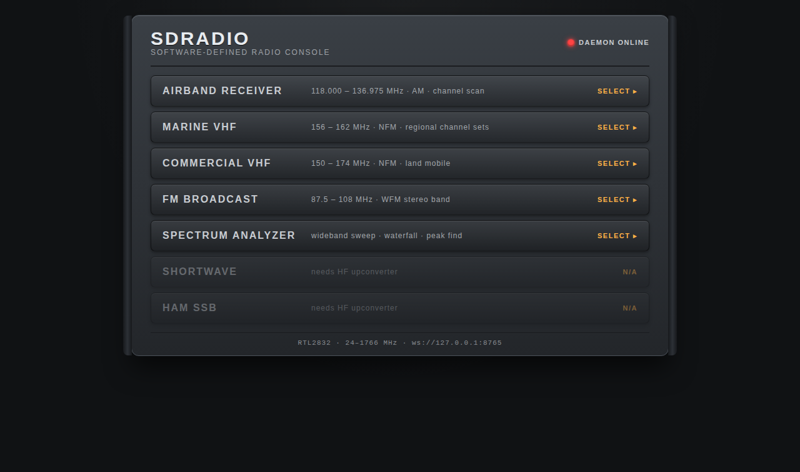
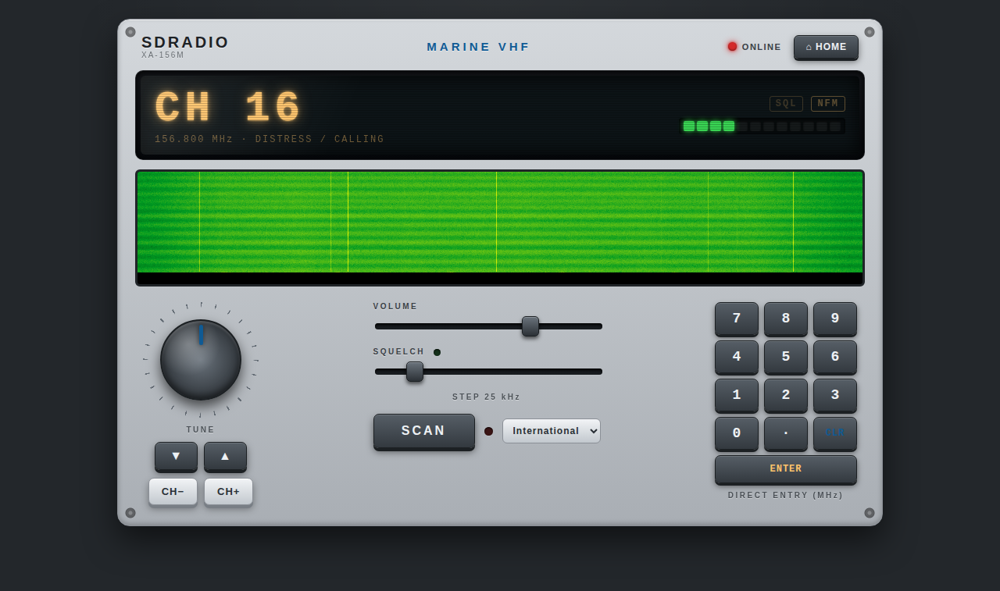
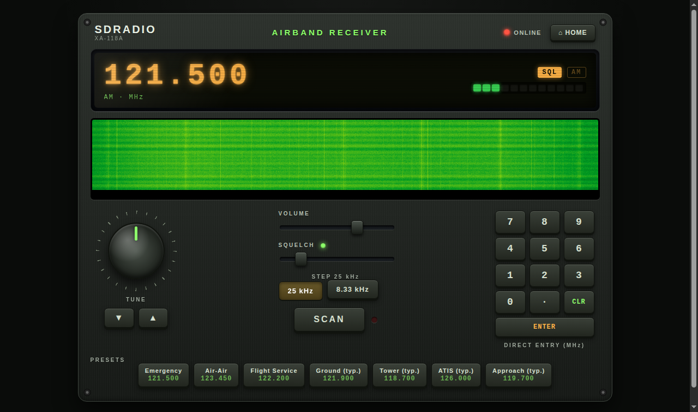
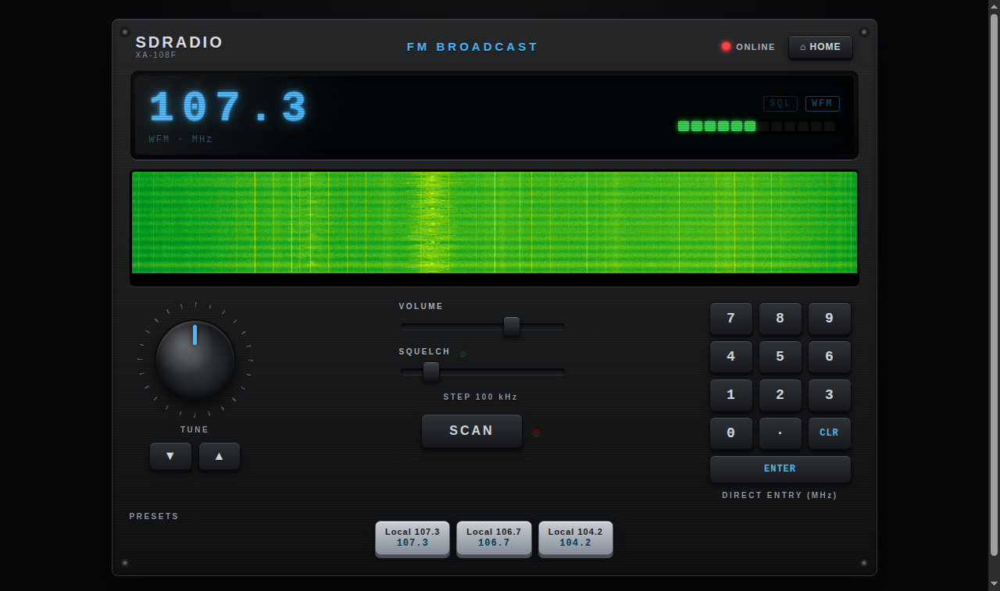
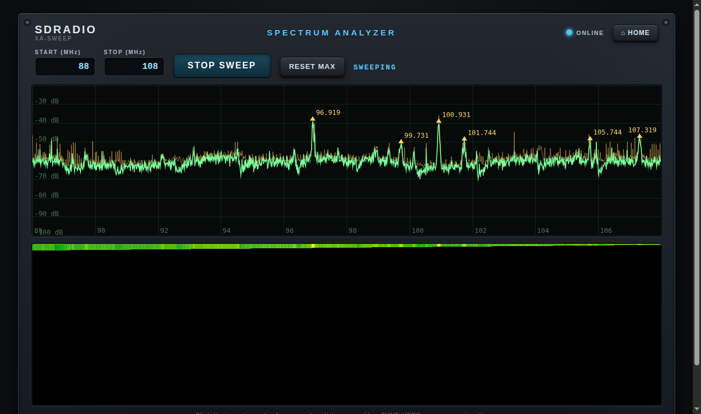

# SDRADIO

**A universal web-based radio receiver for an RTL2832U SDR stick.**
Point a browser at it and get a rack of realistic radios: airband, marine
VHF, commercial VHF, FM broadcast, and a swept spectrum analyzer — with
channel scanning, squelch, waterfall displays, and per-radio skins.

No root. No librtlsdr. No build step. No internet required.



## Features

| Radio | Band | Mode | Details |
|-------|------|------|---------|
| **Airband** | 118–136.975 MHz | AM | 25 kHz / 8.33 kHz spacing, presets, band scan |
| **Marine VHF** | 156–163 MHz | NFM | International / US / UK / Europe channel tables, NOAA WX (US), AIS channels, rapid channel scan |
| **Commercial VHF** | 150–174 MHz | NFM | presets + free tuning |
| **FM Broadcast** | 87.5–108 MHz | WFM | presets, click-to-tune waterfall |
| **Spectrum Analyzer** | any, 24–1766 MHz | — | swept wideband waterfall + trace, max-hold, peak detect, click a peak to open the right receiver pre-tuned |

Every radio panel: glowing LCD, S-meter, squelch with SQL LED, tuning knob,
numeric keypad, step buttons, SCAN with active-channel banner, and a live
click-to-tune waterfall strip.

| Marine | Airband | FM |
|---|---|---|
|  |  |  |



## Hardware

- Any RTL2832U + R820T(2) USB dongle (the ~$10 DVB-T kind) and its antenna.
- Tuning range 24–1766 MHz. **HF (shortwave, AM broadcast, marine/air HF
  SSB) is below the tuner's reach** — the menu shows those as placeholders.
  Add a ~$40 upconverter (or a dongle with direct sampling like the
  RTL-SDR Blog V4) later; the USB/LSB demodulators are already implemented.

## Software requirements

- Linux with the in-kernel `rtl2832_sdr` driver (any recent distro kernel —
  the stick appears as `/dev/swradio0`). The user needs rw access to that
  device (distros grant it via udev ACL to the logged-in user).
- Python 3 with `numpy` and `websockets` (distro packages are fine).
- PHP 8 CLI (only used to serve static pages; any web server works).
- **Not needed:** root, librtlsdr, rtl-sdr tools, blacklisting the DVB
  driver, npm, Composer, or anything from a CDN.

## Quick start

```bash
git clone https://github.com/xaxjon/SDR.git
cd SDR
./start.sh
# then browse to http://<machine>:8090/
```

Click a radio panel once to unlock browser audio (autoplay policy).

### Start at boot

```bash
sudo ./install-services.sh
```

Installs `sdrd.service` + `sdradio-web.service`, enabled at boot.

### Lazy start

If only the web server is running, loading any page automatically spawns
the SDR daemon (`public/bootstrap.php`). So even a bare
`php -S 0.0.0.0:8090 -t public` is enough to bring the whole stack up.

## Using the radios

- **Marine VHF**: pick a region (International/US/UK/Europe), CH± to step,
  SCAN to sweep the channel set; an active channel holds and shows its
  label. Start on CH 16.
- **Airband**: AM, 25/8.33 kHz spacing toggle, presets for common freqs.
- **Keypad**: type MHz directly (e.g. `156.800` ENTER) on any radio.
- **Waterfall strip**: click anywhere to jump to that frequency.
- **Squelch**: fully left = open (hear the noise floor); right = only
  strong signals. The noise floor auto-calibrates per frequency.
- **Spectrum Analyzer**: enter a range, START SWEEP, watch for peaks,
  click a peak → TUNE HERE opens the matching receiver.
- Strong local transmitters: keep them a couple of meters from the SDR
  antenna — point-blank key-ups saturate the ADC (no gain control is
  exposed by the kernel driver, AGC only).

## Architecture

```
RTL2832U ──/dev/swradio0──> sdrd.py (Python daemon)
  V4L2 SDR API, pure stdlib     numpy DSP: AM/NFM/WFM/USB/LSB demod,
  (bin/v4l2sdr.py)              squelch, channel scan, band sweep, FFT
              │
              │ WebSocket ws://host:8765
              │   JSON control + status
              │   binary: s16le 48 kHz audio, uint8 FFT bins
              ▼
        Browser (vanilla JS, AudioWorklet, canvas waterfall)
              ▲
              │ HTTP :8090
        PHP pages (plain PHP 8, zero dependencies)
```

- `bin/v4l2sdr.py` — minimal V4L2 SDR driver wrapper (ioctl + mmap only).
- `bin/sdrd.py` — the daemon. One worker thread owns the SDR; asyncio
  serves any number of browser clients.
- `bin/probe.py`, `bin/test_client.py`, `bin/cdp_check.py` — hardware
  probe, headless end-to-end test, headless-Chrome UI check.
- `public/` — web root: `index.php` menu, `radio.php` (one page, per-service
  config), `spectrum.php`, `assets/js`, `assets/css` skins.
- `data/*.json` — channel/preset tables. Edit to your region/taste.
- `docs/PROTOCOL.md` — full WebSocket protocol reference.
- `systemd/` — service units.

## Troubleshooting

- **Kernel log floods with "video buffer is full"**: a runaway retune rate
  wedged the driver's USB control pipe. Kill the daemon
  (`pkill -f sdrd.py`); replug the stick if it persists. The daemon limits
  scan dwell to ≥200 ms to prevent this.
- **Hiss on a quiet channel**: squelch is open — turn SQUELCH up a notch.
- **Strong nearby transmitter sounds like nothing**: ADC overload — move
  the transmitter a few meters away.
- **Nothing on HF bands**: expected — the tuner stops at 24 MHz. You need
  an upconverter.
- **Disable the stick's IR-remote poller** (constant background i2c
  traffic): `echo 1 | sudo tee /sys/module/dvb_usb_rtl28xxu/parameters/disable_rc`

## Security note

There is **no authentication**: anyone who can reach ports 8090/8765 can
drive the receiver. Intended for trusted LANs / on-board networks. Put it
behind a reverse proxy with auth if you expose it further.

## Roadmap

- HF support via upconverter / direct sampling (USB/LSB demods ready)
- RDS decode for FM broadcast
- Audio recording from the browser
- Multi-channel monitoring within the 2.4 MHz live bandwidth
- Waterfall frequency markers / bandplan overlays

## License

GPL-3.0 — see [LICENSE](LICENSE).
